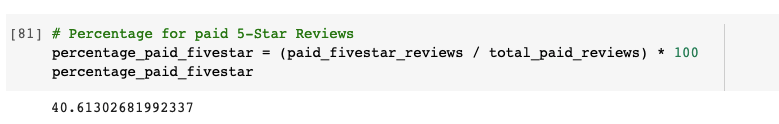
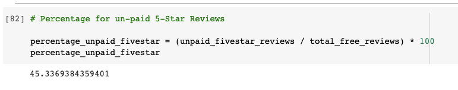

# Amazon_Vine_Analysis

## Overview 

Performed analysis on Amazon's Vine product review data. Due to the size of the datasets, our data needed to be transformed into smaller tables, relevant to clients needs. Transformed data was loaded onto AWS' RDS as PostgresSQL and can be accessed through PGAdmin on clients local machines. 

Additionally, a more in-depth analysis on paid vs unpaid reviews was conducted to determine whether there is a positive bias towards the product with paid reviews. 

## Summary

As shown in the images below, there isn't a bias towards the product when reveiws are paid. Only 40% of the paid reviews received 5-Star ratings. On the other hand 5-Star rating for unpaid reviews are higher percentage at 45%. 

The dataset I worked with was home appliances. In the eCommerce industry home appliances are classified as -- big box - high value - low volume -- items. I propose the client to do an additional analysis on products similar to their own. We will then have more visibility on how fair the Amazon Vine review services is. 

